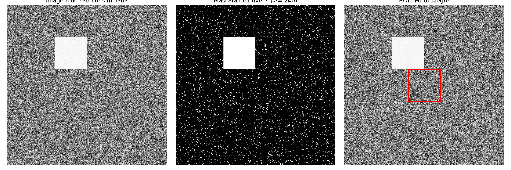

# Desafio Prático — Análise de Imagem de Satélite Simulada

Resposta ao desafio prático de programação do processo seletivo para a Bolsa de Iniciação
Científica no projeto **"Eventos Climáticos e Desastres no RS: Caracterização e Predição
com Inteligência Artificial"**.

**Candidato(a):** Luiz Carlos da Silva Junior  
**Data de entrega:** Junho/2026

---

## Objetivo

A partir de uma matriz simulando uma imagem de satélite (500×500 pixels, valores de 0 a 255),
o script realiza três análises:

1. **Dimensões e tipo de dado** da imagem.
2. **Filtro de máscara de nuvens:** conta e calcula o percentual de pixels considerados
   "nuvem" (valor ≥ 240).
3. **Estatística de uma região de interesse (ROI):** extrai o subquadrado
   (linhas 200–300, colunas 200–300), representando Porto Alegre, e calcula média,
   valor máximo e valor mínimo dos pixels nessa região.

---

## Arquivos entregues

| Arquivo | Descrição |
|---|---|
| `desafio_imagem_satelite.py` | Script principal com todas as funções. |
| `testar_desafio.py` | Testes automáticos que validam os resultados. |
| `visualizacao_imagem_satelite.png` | Imagem gerada pela função de visualização (bônus). |
| `README.md` | Este arquivo. |

---

## Requisitos

- Python 3.8+
- NumPy
- Matplotlib

```bash
pip install numpy matplotlib
```

---

## Como executar

```bash
python desafio_imagem_satelite.py
```

Para rodar os testes automáticos:

```bash
python testar_desafio.py
```

Saída esperada: `Todos os testes passaram!`

---

## Estrutura do código

| Função | Descrição |
|---|---|
| `dimensoes_e_tipo(imagem)` | Imprime o número de linhas/colunas e o `dtype` dos pixels. |
| `filtro_mascara_nuvens(imagem, limiar=240)` | Conta pixels acima do limiar e calcula o percentual de "nuvem". |
| `estatistica_regiao_interesse(imagem, ...)` | Extrai a ROI e calcula média, máximo e mínimo dos pixels. |
| `visualizar_imagem(imagem, ...)` *(bônus)* | Gera figura com a imagem original, a máscara de nuvens e a ROI destacada. |

O bloco de geração da matriz (fornecido no enunciado) é mantido intacto no início do arquivo,
garantindo reprodutibilidade via `np.random.seed(42)`.

---

## Exemplo de saída

```
Matriz da imagem gerada com sucesso!

Dimensões da imagem: 500 linhas x 500 colunas
Tipo de dado dos pixels (dtype): int64

Quantidade de pixels com nuvem (valor >= 240): 24866
Percentual de nuvem na imagem: 9.95%

Estatísticas da Região de Interesse (Porto Alegre) [200:300, 200:300]:
Valor médio dos pixels: 125.58
Valor máximo: 255
Valor mínimo: 0
```

> **Observação:** o percentual de nuvem (~9,95%) é maior do que o esperado apenas
> pelo bloco artificial inserido no enunciado (que corresponde a 4% da imagem).
> Isso ocorre porque a imagem de fundo é aleatória entre 0 e 255, e pixels fora do bloco
> também ultrapassam o limiar 240 por acaso — estatisticamente, cerca de 6,25% dos
> pixels aleatórios devem cair nessa faixa (16 valores possíveis acima de 240 em 256 totais).

---

## Visualização gerada



Os três painéis mostram, da esquerda para a direita:
- **Imagem original** em escala de cinza, com o bloco branco da "nuvem" artificial visível.
- **Máscara de nuvens:** pixels com valor ≥ 240 em branco; os pontinhos no fundo confirmam o "ruído" aleatório acima do limiar.
- **ROI destacada:** retângulo vermelho marca a região de Porto Alegre; note que ela não se sobrepõe à nuvem, o que é consistente com a estatística obtida (mínimo 0, máximo 255, média ~127).